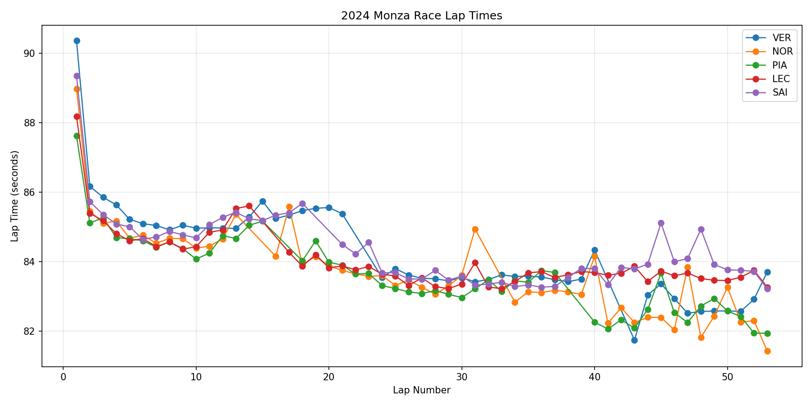

# 2024 Monza Strategy Analysis

## Session

- Year: 2024
- Race: Monza
- Session: R
- Drivers analyzed: VER, NOR, PIA, LEC, SAI

## Lap Time Plot

## Driver Comparison

| Driver   |   CleanLapCount |   MeanLapTime |   MedianLapTime |   BestLapTime |   MedianDeltaToOther |
|:---------|----------------:|--------------:|----------------:|--------------:|---------------------:|
| NOR      |              49 |       83.7171 |          83.601 |        81.432 |                -0.02 |
| VER      |              49 |       84.2515 |          83.621 |        81.745 |                 0.02 |

## Stint Summary

| Driver   |   Stint | Compound   |   StartLap |   EndLap |   LapCount |   StartTyreLife |   EndTyreLife |   MeanLapTime |   MedianLapTime |   BestLapTime |   StintLength |
|:---------|--------:|:-----------|-----------:|---------:|-----------:|----------------:|--------------:|--------------:|----------------:|--------------:|--------------:|
| LEC      |       1 | MEDIUM     |          1 |       14 |         14 |               1 |            14 |       85.1089 |         84.828  |        84.362 |            14 |
| LEC      |       2 | HARD       |         17 |       53 |         37 |               2 |            38 |       83.6249 |         83.624  |        83.226 |            37 |
| NOR      |       1 | MEDIUM     |          1 |       13 |         13 |               1 |            13 |       85.1439 |         84.674  |        84.391 |            13 |
| NOR      |       2 | HARD       |         16 |       31 |         16 |               2 |            17 |       83.8286 |         83.633  |        83.067 |            16 |
| NOR      |       3 | HARD       |         34 |       53 |         20 |               2 |            21 |       82.7004 |         82.557  |        81.432 |            20 |
| PIA      |       1 | MEDIUM     |          1 |       15 |         15 |               1 |            15 |       84.8851 |         84.67   |        84.077 |            15 |
| PIA      |       2 | HARD       |         18 |       37 |         20 |               2 |            21 |       83.4972 |         83.4325 |        82.968 |            20 |
| PIA      |       3 | HARD       |         40 |       53 |         14 |               2 |            15 |       82.4584 |         82.3775 |        81.943 |            14 |
| SAI      |       1 | MEDIUM     |          1 |       18 |         18 |               1 |            18 |       85.3788 |         85.2085 |        84.642 |            18 |
| SAI      |       2 | HARD       |         21 |       53 |         33 |               2 |            34 |       83.7676 |         83.722  |        83.219 |            33 |
| VER      |       1 | HARD       |          1 |       21 |         21 |               1 |            21 |       85.5603 |         85.287  |        84.918 |            21 |
| VER      |       2 | HARD       |         24 |       40 |         17 |               2 |            18 |       83.5882 |         83.542  |        83.424 |            17 |
| VER      |       3 | MEDIUM     |         43 |       53 |         11 |               2 |            12 |       82.778  |         82.585  |        81.745 |            11 |

## Estimated Degradation

| Driver   |   Stint | Compound   |   LapCountUsed |   StartLap |   EndLap |   StartTyreLife |   EndTyreLife |   DegradationSecondsPerLap |   EstimatedBaseLapTime |   MeanLapTime |   MedianLapTime |
|:---------|--------:|:-----------|---------------:|-----------:|---------:|----------------:|--------------:|---------------------------:|-----------------------:|--------------:|----------------:|
| LEC      |       1 | MEDIUM     |             14 |          1 |       14 |               1 |            14 |                -0.0785143  |                85.6977 |       85.1089 |         84.828  |
| LEC      |       2 | HARD       |             37 |         17 |       53 |               2 |            38 |                -0.00832029 |                83.7914 |       83.6249 |         83.624  |
| NOR      |       1 | MEDIUM     |             13 |          1 |       13 |               1 |            13 |                -0.169121   |                86.3278 |       85.1439 |         84.674  |
| NOR      |       2 | HARD       |             16 |         16 |       31 |               2 |            17 |                -0.0545824  |                84.3472 |       83.8286 |         83.633  |
| NOR      |       3 | HARD       |             20 |         34 |       53 |               2 |            21 |                -0.0564233  |                83.3492 |       82.7003 |         82.557  |
| PIA      |       1 | MEDIUM     |             15 |          1 |       15 |               1 |            15 |                -0.0810143  |                85.5332 |       84.8851 |         84.67   |
| PIA      |       2 | HARD       |             20 |         18 |       37 |               2 |            21 |                -0.0335481  |                83.8831 |       83.4973 |         83.4325 |
| PIA      |       3 | HARD       |             14 |         40 |       53 |               2 |            15 |                -0.00598901 |                82.5093 |       82.4584 |         82.3775 |
| SAI      |       1 | MEDIUM     |             18 |          1 |       18 |               1 |            18 |                -0.0573075  |                85.9233 |       85.3788 |         85.2085 |
| SAI      |       2 | HARD       |             33 |         21 |       53 |               2 |            34 |                 0.00394552 |                83.6966 |       83.7676 |         83.722  |
| VER      |       1 | HARD       |             21 |          1 |       21 |               1 |            21 |                -0.0697506  |                86.3275 |       85.5603 |         85.287  |
| VER      |       2 | HARD       |             17 |         24 |       40 |               2 |            18 |                 0.00924265 |                83.4958 |       83.5882 |         83.542  |
| VER      |       3 | MEDIUM     |             11 |         43 |       53 |               2 |            12 |                 0.0574091  |                82.3761 |       82.778  |         82.585  |

## Notes and Limitations

The degradation estimate is a simple linear fit of lap time versus tyre life. It should not be interpreted as pure tyre degradation because lap time is also affected by fuel burn, traffic, safety car periods, track evolution, driver management, and car condition.
