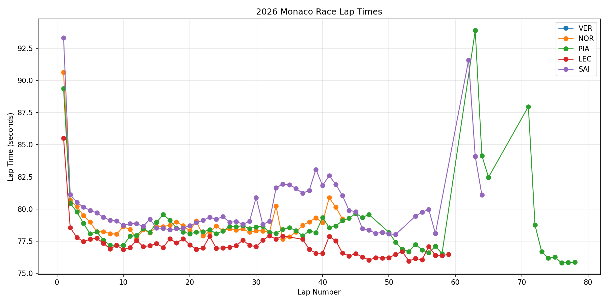

# 2026 Monaco Strategy Analysis

## Session

- Year: 2026
- Race: Monaco
- Session: R
- Drivers analyzed: VER, NOR, PIA, LEC, SAI

## Lap Time Plot

## Clean Pace Ranking

This ranks drivers by median clean lap time after removing pit laps and extreme slow laps. It is useful for a quick race-pace comparison, but it does not fully normalize for compound, fuel, traffic, or strategy.

| Driver   |   CleanLapCount |   MeanLapTime |   MedianLapTime |   BestLapTime |   DeltaToFastestMedian |
|:---------|----------------:|--------------:|----------------:|--------------:|-----------------------:|
| LEC      |              57 |       77.1929 |          77.07  |        75.964 |                 0.4145 |
| PIA      |              67 |       78.7869 |          78.287 |        75.816 |                 1.6315 |
| NOR      |              43 |       78.9932 |          78.478 |        77.67  |                 1.8225 |
| SAI      |              58 |       80.1988 |          79.29  |        78.022 |                 2.6345 |

## Head-to-Head Driver Comparison

| Driver   |   CleanLapCount |   MeanLapTime |   MedianLapTime |   BestLapTime |   MedianDeltaToOther |
|:---------|----------------:|--------------:|----------------:|--------------:|---------------------:|
| NOR      |              43 |       78.9932 |          78.478 |         77.67 |                  nan |

## Stint Summary

| Driver   |   Stint | Compound   |   StartLap |   EndLap |   LapCount |   StartTyreLife |   EndTyreLife |   MeanLapTime |   MedianLapTime |   BestLapTime |   StintLength |
|:---------|--------:|:-----------|-----------:|---------:|-----------:|----------------:|--------------:|--------------:|----------------:|--------------:|--------------:|
| LEC      |       1 | MEDIUM     |          1 |       34 |         34 |               1 |            34 |       77.6138 |         77.3255 |        76.84  |            34 |
| LEC      |       2 | HARD       |         37 |       59 |         23 |               2 |            24 |       76.5708 |         76.474  |        75.964 |            23 |
| NOR      |       1 | MEDIUM     |          1 |       43 |         43 |               1 |            43 |       78.9932 |         78.478  |        77.67  |            43 |
| PIA      |       1 | MEDIUM     |          1 |       47 |         47 |               1 |            47 |       78.7519 |         78.468  |        77.18  |            47 |
| PIA      |       2 | HARD       |         50 |       58 |          9 |               2 |            10 |       77.055  |         76.863  |        76.541 |             9 |
| PIA      |       4 | SOFT       |         63 |       65 |          3 |               8 |            10 |       86.8367 |         84.159  |        82.472 |             3 |
| PIA      |       6 | SOFT       |         71 |       78 |          8 |               7 |            14 |       77.9227 |         76.2225 |        75.816 |             8 |
| SAI      |       1 | MEDIUM     |          1 |       51 |         51 |               1 |            51 |       79.9509 |         79.13   |        78.022 |            51 |
| SAI      |       2 | SOFT       |         54 |       57 |          4 |               2 |             5 |       79.3183 |         79.605  |        78.095 |             4 |
| SAI      |       3 | SOFT       |         62 |       64 |          3 |              10 |            12 |       85.5873 |         84.082  |        81.093 |             3 |

## Estimated Pace Slope / Degradation Proxy

The slope below is a simple linear fit of lap time versus tyre life. Positive values mean laps got slower as tyre life increased. Negative values mean laps got faster as the stint progressed, which can happen because of fuel burn, track evolution, clean air, or race management.

| Driver   |   Stint | Compound   |   LapCountUsed |   StartLap |   EndLap |   StartTyreLife |   EndTyreLife |   DegradationSecondsPerLap |   EstimatedBaseLapTime |   MeanLapTime |   MedianLapTime |
|:---------|--------:|:-----------|---------------:|-----------:|---------:|----------------:|--------------:|---------------------------:|-----------------------:|--------------:|----------------:|
| LEC      |       1 | MEDIUM     |             34 |          1 |       34 |               1 |            34 |                 -0.04415   |                78.3864 |       77.6138 |         77.3255 |
| LEC      |       2 | HARD       |             23 |         37 |       59 |               2 |            24 |                 -0.0376443 |                77.0602 |       76.5708 |         76.474  |
| NOR      |       1 | MEDIUM     |             43 |          1 |       43 |               1 |            43 |                 -0.0329606 |                79.7184 |       78.9932 |         78.478  |
| PIA      |       1 | MEDIUM     |             47 |          1 |       47 |               1 |            47 |                 -0.0164692 |                79.1471 |       78.7519 |         78.468  |
| PIA      |       2 | HARD       |              9 |         50 |       58 |               2 |            10 |                 -0.1324    |                77.8494 |       77.055  |         76.863  |
| PIA      |       6 | SOFT       |              8 |         71 |       78 |               7 |            14 |                 -1.21236   |                90.6525 |       77.9228 |         76.2225 |
| SAI      |       1 | MEDIUM     |             51 |          1 |       51 |               1 |            51 |                 -0.015754  |                80.3605 |       79.9509 |         79.13   |

## Notes and Limitations

This report uses cleaned lap-time data from FastF1. The analysis removes pit laps and extreme slow laps, but it does not yet fully model fuel burn, traffic, safety car periods, tyre warmup, driver management, car damage, or exact pit-loss time. Therefore, the results should be treated as strategy indicators rather than final proof.
